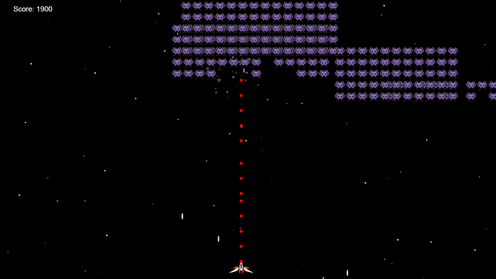

# spaceInvader



> A recreation of the retro arcade game using Vanilla JavaScript and the powerful HTML5 Canvas.
---


* [Description](#general-info)
* [Play Here](#play)
* [Technologies](#technologies)
* [References](#references)
* [Contents](#contents)
* [Contributors](#contributors)
---


## Description
A recreation of the retro arcade game using Vanilla JavaScript and the powerful HTML5 Canvas.

---

## Play
https://lighthearted-rugelach-de22eb.netlify.app/

---
## Technologies
This project is built with:
* HTML5 Canvas
* Object Oriented JavaScript

---

## References
- Tutorials followed in the making of this project: 
    - https://www.youtube.com/watch?v=MCVU0w73uKI&list=WL&index=13&t=5255s

---	
## Contents
Content of the project folder:

```
 Top level of project folder: 
├── img              # image folder
├── index.html
├── index.js               
└── README.md
```
---
## Contributors
* Hairun Huang (hairunhuang@Gmail.com)

---
**Version 1.0.0**
[Back to the top](#general-info)

